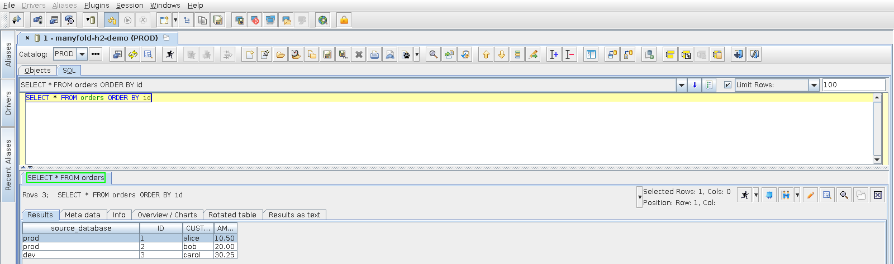

# manyfold-jdbc

A pass-through JDBC driver that runs one SQL statement against several databases and returns
the rows as a single result set, with a `source_database` column telling you where each row
came from.



> **Status:** pre-release. The driver works and is tested against H2 and SQLite backends, but
> nothing has been published to Maven Central yet. Until then, build the jar with
> `./gradlew jar` and pick it up from `build/libs/`.

## Why

You have the same schema in more than one place, prod and dev, or one database per region, and
you want to run a query against all of them from a normal SQL client and see the results side by
side. manyfold-jdbc sits between your client and the real JDBC drivers. It is a single jar with
no dependencies, it does not run a server, and it does not parse or rewrite your SQL.

## How it works

```
jdbc:manyfold:prod=jdbc:postgresql://prod-host:5432/app || dev=jdbc:postgresql://dev-host:5432/app
```

1. The driver opens one real connection per backend using the vendor drivers already on the
   client's driver classpath.
2. Every statement is forwarded verbatim to every backend, concurrently.
3. The rows come back concatenated in URL order. Column 1 is `source_database` and holds the
   logical name (`prod`, `dev`). The remaining columns are the backend's columns, unchanged.
4. Metadata calls that need a single answer, such as the table list a SQL client shows in its
   tree, are answered by the first backend.

By default the driver is **read-only**: anything that is not a query is refused before it
reaches a backend. Set `readOnly=false` in the URL options to fan writes out to every backend.

## Try it in five minutes

You do not need a database server to see the driver work. Two H2 in-memory databases are enough,
and the URL below creates and fills both of them when you connect.

```
./gradlew clientBundle
```

The task copies two jars into `build/client/`: `manyfold-jdbc-0.1.0-SNAPSHOT.jar` (the driver)
and `h2-2.5.252.jar` (the backend). Then, in SQuirreL SQL:

1. Create the driver definition as described in [SQuirreL SQL](#squirrel-sql). On the **Extra
   Class Path** tab add **both** jars from `build/client/`.
2. Create an alias for that driver and paste this URL. It must be on one line. Leave the user
   name and password empty.

```
jdbc:manyfold:prod=jdbc:h2:mem:prod;DB_CLOSE_DELAY=-1;INIT=CREATE TABLE IF NOT EXISTS orders AS SELECT * FROM (VALUES (1, 'alice', 10.50), (2, 'bob', 20.00)) AS t(id, customer, amount) || dev=jdbc:h2:mem:dev;DB_CLOSE_DELAY=-1;INIT=CREATE TABLE IF NOT EXISTS orders AS SELECT * FROM (VALUES (3, 'carol', 30.25)) AS t(id, customer, amount)
```

3. Connect and run these three statements, one at a time:

| Statement | Expect |
|---|---|
| `SELECT * FROM orders ORDER BY id` | Three rows. `source_database` is `prod`, `prod`, `dev`. |
| `SELECT count(*) FROM orders` | Two rows: `2` from `prod` and `1` from `dev`. |
| `DELETE FROM orders` | Refused with `Refused in read-only mode`. Nothing is deleted. |

`source_database` is added by the driver, so it is not a column of `orders` and you cannot
filter or group by it in your SQL. Each backend answers the count for itself, which is why you
get one row per backend.

The in-memory databases live only while SQuirreL is running. H2 keeps them per driver
definition, so a second alias on the same driver definition sees the same data, and restarting
SQuirreL starts from scratch. The `IF NOT EXISTS` in the URL keeps a reconnect from adding the
rows twice.

To try fan-out writes, insert `readOnly=false;` right after `jdbc:manyfold:` in the same URL.

## One SQL, three databases

The same driver fans out to different database products. This URL names a PostgreSQL, a MariaDB
and an H2 backend. It must be on one line. Use user name `demo` and password `demo`; H2 accepts
any user for a fresh in-memory database.

```
jdbc:manyfold:postgres=jdbc:postgresql://localhost:5432/demo || mariadb=jdbc:mariadb://localhost:3306/demo || h2=jdbc:h2:mem:demo;DB_CLOSE_DELAY=-1;INIT=CREATE TABLE IF NOT EXISTS orders AS SELECT * FROM (VALUES (1, 'alice', 10.50), (2, 'bob', 20.00)) AS t(id, customer, amount)
```

The PostgreSQL and MariaDB servers each hold a table `orders(id, customer, amount)` with their
own rows. The repository ships a Docker Compose file that starts both and seeds them from
[validation/db/](validation/db/). Run the whole GUI check against them, in one command:

```
docker compose -f validation/docker-compose.yml up --abort-on-container-exit squirrel
```

Or in two steps, starting the servers first and running the check from your own machine:

```
docker compose -f validation/docker-compose.yml up -d --wait mariadb postgres
MODE=multi validation/run.sh
```

`SELECT * FROM orders ORDER BY id` then returns five rows, in URL order and not sorted across
backends, because every backend sorts its own rows:

| source_database | id | customer | amount |
|---|---|---|---|
| postgres | 20 | postgres | 200.00 |
| mariadb | 10 | maria | 100.00 |
| mariadb | 11 | db | 110.00 |
| h2 | 1 | alice | 10.50 |
| h2 | 2 | bob | 20.00 |

The vendor JDBC jars are downloaded by `validation/run.sh` with pinned checksums rather than
declared in Gradle, because the MariaDB driver is LGPL-2.1, this project's dependency review
denies that license, and manyfold-jdbc itself has no dependency on either driver.

## URL syntax

```
jdbc:manyfold:[option=value;...][name=]<jdbc-url> || [name=]<jdbc-url> [|| ...]
```

| Part | Meaning |
|---|---|
| ` \|\| ` | Separates backends. Chosen because it never appears inside a JDBC URL. |
| `name=` | Optional logical name for the backend, shown in `source_database`. Without it the name is derived from the URL, for example `postgresql://prod-host:5432/app`. |
| `sourceColumn=` | Name of the injected column. Default `source_database`. |
| `readOnly=` | `true` (default) refuses statements that can modify data. `false` forwards everything. |

The username and password given to the connection apply to every backend. To override them for
one backend, set the driver properties `manyfold.<name>.user` and `manyfold.<name>.password`.
SQL clients expose driver properties in their connection dialog.

## Setting up a SQL client

The one rule: the vendor driver jars go in the **same driver definition** as the manyfold jar.
Both SQuirreL SQL and DBeaver build one class loader per driver definition, and manyfold finds
the vendor drivers through that class loader. A vendor driver registered elsewhere in the client
is invisible to it.

Driver class name, for any client that asks:

```
io.github.jbburns.manyfold.jdbc.ManyfoldDriver
```

### SQuirreL SQL

1. Open the **Drivers** tab on the left and press **+** (*Create a new driver*).
2. Name: `manyfold`. Example URL: `jdbc:manyfold:prod=jdbc:postgresql://HOST/db || dev=jdbc:postgresql://HOST/db`.
3. On the **Extra Class Path** tab press **Add** and select the manyfold jar **and** every vendor
   driver jar you will use behind it, for example the PostgreSQL driver jar.
4. Press **List Drivers** and pick `io.github.jbburns.manyfold.jdbc.ManyfoldDriver` in the
   *Class Name* box. Press **OK**.
5. Open the **Aliases** tab, press **+**, choose the `manyfold` driver, paste your real URL, and
   enter the user name and password that apply to every backend.
6. For a backend that needs different credentials press **Properties**, open the **Driver
   properties** tab, tick *Use driver properties*, and set `manyfold.<name>.user` and
   `manyfold.<name>.password`. The names come from your URL.
7. Connect. Run a query; the first column of every result is `source_database`.

The object tree and autocomplete are populated from the first backend in the URL.

### DBeaver

1. **Database → Driver Manager → New**.
2. Driver Name: `manyfold`. Class Name: `io.github.jbburns.manyfold.jdbc.ManyfoldDriver`.
   URL Template: `jdbc:manyfold:prod=jdbc:postgresql://HOST/db || dev=jdbc:postgresql://HOST/db`.
3. On the **Libraries** tab press **Add File** and add the manyfold jar **and** every vendor
   driver jar. Press **Find Class** and confirm the manyfold driver class is selected. Press
   **OK**.
4. **Database → New Database Connection**, search for `manyfold`, and enter your real URL,
   user name and password on the **Main** tab.
5. Per-backend credentials go on the **Driver properties** tab as `manyfold.<name>.user` and
   `manyfold.<name>.password`.
6. Press **Test Connection**, then **Finish**.

DBeaver identifies the SQL dialect from the first backend in the URL, so put the database you
want dialect-aware editing for first.

### Any other JDBC client or application

Put the manyfold jar and the vendor jars on the same classpath and use the URL. The driver
registers itself with `DriverManager`, so `DriverManager.getConnection(url, user, password)` works
without a `Class.forName` call.

## What the driver does and does not do

- **Rows are concatenated, not interleaved.** All rows from the first backend, then all from the
  second, and so on. An `ORDER BY` orders rows within each backend only.
- **Every backend must return the same columns.** A different column count fails the query
  with a message naming the backend. Column names and types are taken from the first backend.
- **Results stream.** Nothing is buffered, so large results cost no more memory than they would
  through the vendor driver. The merged result set is forward-only and read-only.
- **Backends run concurrently.** A query that takes ten seconds on each of two backends takes
  about ten seconds, not twenty.
- **Failures are loud.** If any backend fails, the whole statement fails with one exception that
  names the backend and carries the vendor exception, SQL state and error code. Partial results
  are never returned.
- **Read-only mode is a guard, not a parser.** It refuses a statement whose first keyword is not
  a query keyword, or that contains a modifying keyword such as `INSERT`, `DELETE`, `INTO` or
  `CALL` outside quotes and comments. This also refuses `SELECT ... FOR UPDATE`. It cannot see a
  function with side effects called from a `SELECT`; for that, every backend connection is also
  asked for a read-only transaction, which PostgreSQL and others enforce.
- **Writes fan out with `readOnly=false`.** Update counts are summed across backends, batches
  are summed element-wise, and `commit`, `rollback` and savepoints reach every backend. There is
  no distributed transaction: a commit that succeeds on one backend and fails on another leaves
  them different.
- **Single-valued calls go to the first backend.** `DatabaseMetaData`, generated LOB objects,
  warnings and similar come from the first backend in the URL.
- **Credentials never leak.** URLs are redacted before they appear in names, messages, or
  `DatabaseMetaData.getURL()`.

## Requirements

- Java 17 or newer. SQuirreL SQL 5.x and current DBeaver both qualify.
- The vendor JDBC driver for each backend.

## Building

```
./gradlew build        # format check, static analysis, tests on Java 17 and 21, coverage
./gradlew jar          # just the driver jar, in build/libs/
```

[DEVELOPING.md](DEVELOPING.md) covers the whole developer workflow: tests, formatting, static
analysis, dependency updates and the publishing dry run.

Releases are described in [RELEASING.md](RELEASING.md).

See [CONTRIBUTING.md](CONTRIBUTING.md) for the development workflow and
[CLAUDE.md](CLAUDE.md) for the design invariants.

## GUI validation

An on-demand script launches SQuirreL SQL with the driver and two H2 databases, runs the three
statements from "Try it in five minutes" through the real GUI, and saves screenshots. With
`MODE=multi` it does the same against PostgreSQL, MariaDB and H2 together. It is not part of CI;
see [validation/README.md](validation/README.md) and [DEVELOPING.md](DEVELOPING.md).

## Maintenance status

Maintained on a best-effort basis with no response-time commitment. Issues and pull requests are
welcome; see [SUPPORT.md](SUPPORT.md) and [CONTRIBUTING.md](CONTRIBUTING.md).

## Why "manyfold"

A manifold is the engine part that joins several pipes into one. This driver takes many
database queries and folds them into a single result set.

## License

[Apache License 2.0](LICENSE).
